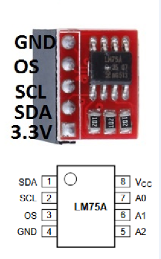
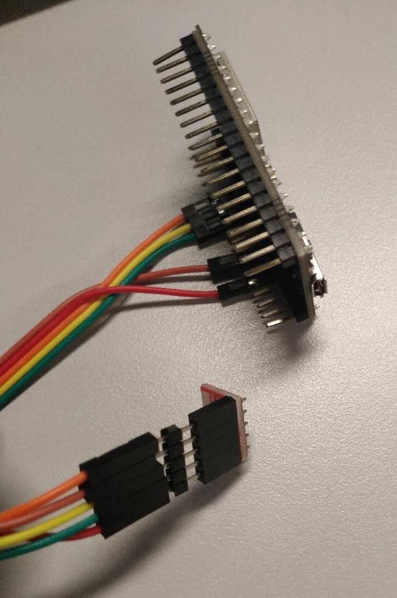
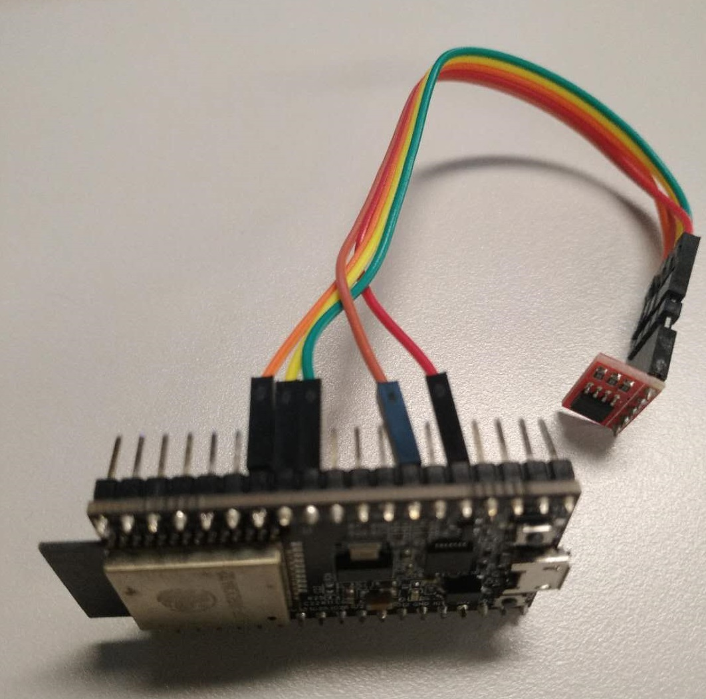

# ESP32_LM75A README

## Description:
This is a LM75A temperature sensor device driver for ESP32(ESP32-DevKitC).

## Setup HW environment
connect ESP32 and LM75A like this:

LM75A sensor | Despriction | ESP32 (demo)
-------- | -------- | --------
VCC      | Power PIN | GPIO2
GND      | GND | GND
SDA      | A4 (I2C SDA) | GPIO 18
SCL      | A5 (I2C SCL) | GPIO 19
A0      | GND (or VCC to increase I2C address of 1) | None
A1      | GND (or VCC to increase I2C address of 2)| None
A2      | GND (or VCC to increase I2C address of 4)| None
OS      | Interrupt PIN | GPIO4 

## Setup SW environment
1. Clone [esp-idf](https://github.com/espressif/esp-idf "Title") and setup it as [guide](https://docs.espressif.com/projects/esp-idf/en/latest/get-started/linux-setup.html).
2. Clone esp32_lm75a
3. cd esp32_lm75a
4. make menuconfig
5. make && make flash

## Use the esp32_lm75a demo
esp32> lm75a init  
I (36803) gpio: GPIO[2]| InputEn: 0| OutputEn: 1| OpenDrain: 0| Pullup: 0| Pulldown: 0| Intr:0  
I (36803) gpio: GPIO[4]| InputEn: 1| OutputEn: 0| OpenDrain: 0| Pullup: 1| Pulldown: 0| Intr:2  
esp32> lm75a temp    
lm75a_read_temperature=26.5  
esp32> lm75a set_tos 30    
lm75a_set_tos: 30  
esp32> lm75a set_thys 29    
lm75a_set_thys: 29  
esp32> lm75a set_int 1    
lm75a_set_int: 1  
init_os_gpio!  
(make temperature high enough to 30)    
esp32> GPIO[4] intr, val: 0(interrupt happened)    

(make temperature go down below 29)    
esp32> GPIO[4] intr, val: 0 (interrupt happened)    

esp32> lm75a set_int 0    
lm75a_set_int: 0  
deinit_os_gpio!  
quit gpio_int_task  
esp32> lm75a deinit    
deinit_os_gpio!  
